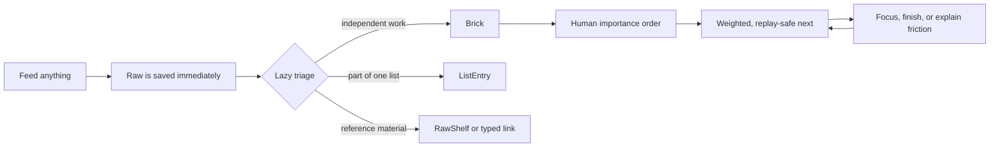
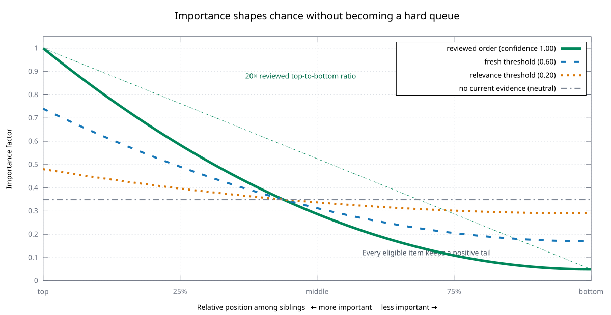
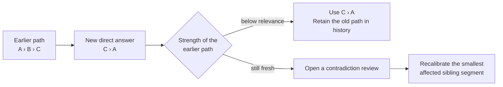
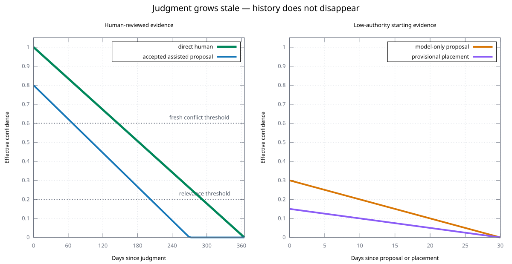
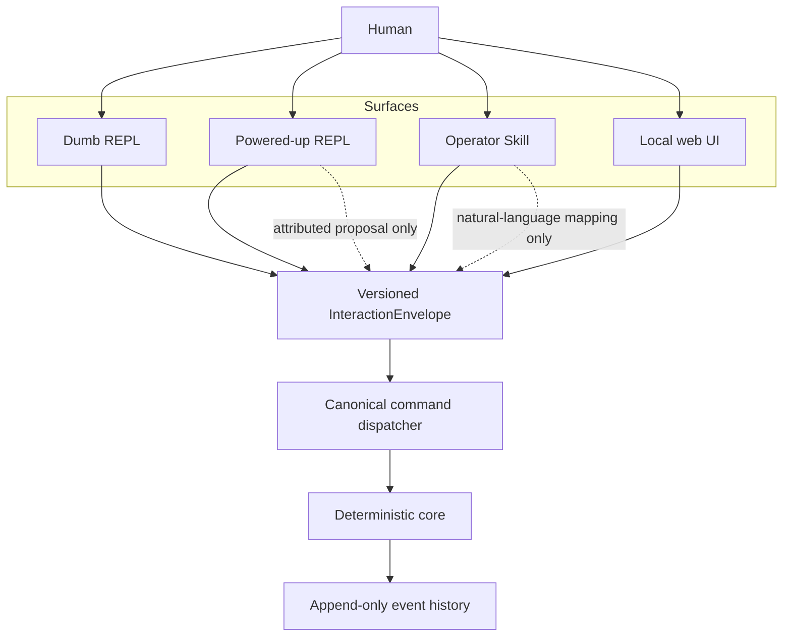

# Little Ant 🐜🧱

<p align="center">
  
</p>

> *One brick at a time. Inch by inch, anything's a cinch.*

> [!IMPORTANT]
> Little Ant 1.0 is being delivered incrementally. The local `1.0.0-alpha.1`
> supports the dumb daily loop and safe migration from the author's real v0
> dataset; integrations and assisted surfaces remain experimental. See the
> [alpha contract](implementation/releases/v1-alpha.md) and
> [beta backlog](implementation/releases/v1-beta.md).

## TL;DR

Little Ant is a personal focus engine for people who have more intentions than
attention.

- **Feed first, organize later.** Any text, URL, note, or imported item is saved
  immediately as Raw material. Classification is lazy.
- **Importance is human; focus is dynamic.** You maintain a strict importance
  order. Little Ant separately calculates what is useful and eligible now.
- **Next is a deterministic weighted draw.** Important work is much more likely,
  but the long tail never disappears.
- **One work abstraction.** A Brick can stay small, become a project, own a
  checklist, repeat, recur, form a habit, or represent an exact commitment.
- **Dumb mode is complete.** AI may suggest, translate, or prefill, but it never
  supplies a missing workflow or mutates the core directly.

Most tools solve only one part of this problem: storing tasks, scheduling fixed
events, planning projects, tracking habits, or chatting with an AI. Little Ant
connects those parts without hiding judgment inside an opaque score. See
[Alternatives](#alternatives) for the trade-offs.

## Install the local alpha

[Nix](https://nixos.org/download/) builds the release and keeps its runtime
dependencies isolated:

```sh
git clone https://github.com/felipelalli/little-ant.git
cd little-ant
git switch v1
nix profile install path:.#little-ant
~/.nix-profile/bin/lant --version
```

The last command prints `lant 1.0.0-alpha.1`. Run `lant` for the one-key dumb
REPL or use the same engine directly, for example:

```sh
lant feed "buy milk"
lant next
lant search milk
lant order
```

If an older `lant` appears earlier in `PATH`, invoke
`~/.nix-profile/bin/lant` explicitly or adjust `PATH` before migrating. The
[alpha contract](implementation/releases/v1-alpha.md) lists the supported
surface and the deliberately deferred beta work.

## Why Little Ant?

A normal task list slowly becomes a museum of good intentions:

1. new material arrives faster than it can be classified;
2. a single “priority” field mixes importance, urgency, readiness, and mood;
3. the top item becomes repetitive, so the list is ignored;
4. old judgments silently become stale;
5. every new tool introduces another inbox.

Little Ant replaces that cycle with one small loop:



The happy path stays short. Structure appears only when real use reveals that
it is needed.

## The model

### Raw: preserve before interpreting

Every accepted `feed` creates one durable Raw in the Inbox. A Raw can contain
text, a URI, structured data, or a blob. It can later become:

- a Brick description;
- evidence or an attachment;
- the source of a Brick or ListEntry;
- material on one or more flat RawShelves;
- a source-backed snapshot that can be reconciled later.

Routing never consumes the Raw. Original content, revisions, provenance, and an
optional attributed English normalization remain distinguishable.

```text
Feed Little Ant

Tip: prefer English for consistent titles and search.

› milk
```

Pressing Enter creates `+milk "milk"` and returns to the ordinary useful
envelope without a receipt screen. No Nature, Domain, date, importance, or
destination is required at entry time.

### Brick: one intention, as much structure as needed

A Brick is the universal unit of work. It starts active and has one position
among its siblings. It may later become done, archived, superseded, or merged.
Scheduled commitments additionally record missed or cancelled outcomes.

`seed`, `committed`, and `ready` do not exist. Higher placement in the
importance tree already expresses stronger commitment.

Optional phase is independent:

```text
💡 idea  →  📐 spec  →  🔨 execution  →  🧪 validation
```

If “carry this enormous rock” proves too large, skip diagnosis can propose
breaking it into parts. The same Brick keeps its identity and becomes a
project; its children then carry execution. The interface does not begin with a
project-management form.

### ListEntry, Nature, Template, and Domain

| Concept | Plain meaning |
|---|---|
| **ListEntry** | A lightweight item shown with its owning checklist, such as Milk under Buy groceries |
| **Nature** | A small core behavior profile: task, project, collection, checklist, repeatable, obligation, habit, or scheduled commitment |
| **Template** | An inspectable creation recipe such as `grocery_list`, `flight`, `bug_fix`, or `physical_activity` |
| **Domain** | A non-exclusive hierarchical subject such as `Orbit › R&D › Rock Splitter` |

Composition and Domain are independent. One Brick may belong to several
Domains without being copied.

## Importance is not next

Little Ant exposes two views because they answer different questions:

| View | Question | What changes it? |
|---|---|---|
| **Importance order** | “What matters more?” | Human comparisons between siblings |
| **Focus forecast** | “Where might attention be useful now?” | Eligibility, importance, dates, context, pressure, reviews, and replay-safe chance |

Binary insertion asks one concrete question:

```text
Is

#rlp "Release the payment service"

    more important than

#icr "Investigate customer reports"
?

[m]ore important   [l]ess important   [s]kip   [?] I don't know
```

Skip is not equality. Little Ant tries a nearby comparison and may eventually
keep a provisional strict position that will return for validation.

<p align="center">
  
</p>

The factory curve is intentionally simple. At fully reviewed confidence, the
top sibling receives a 20:1 importance factor over the bottom sibling before
other bounded signals. Every eligible candidate retains positive probability.
The exact fixed-point formula and reference vectors are
[normative and inspectable](spec/little-ant-1.0/deterministic-calculation-profile.md).

### Judgment can become stale

Little Ant evaluates a contrary answer against the surviving authority of the
path it challenges:



The factory profile turns provenance and age into four public labels:

<p align="center">
  
</p>

Direct human answers start stronger and age more slowly. Assisted proposals
and provisional placements retain their provenance. A conflict among fresh
judgments opens recalibration; an old weak path moves into history. Exact
values and reference vectors remain
[normative and inspectable](spec/little-ant-1.0/deterministic-calculation-profile.md).

## The daily experience

The REPL begins with one useful proposal:

```text
Work:

#rrsr "Review Rock Splitter rules"

Focus?

[y]es    [s]kip    [?] I don't know
[/] more...
```

Accepting it produces a quieter resting screen:

```text
Current focus:

#rrsr "Review Rock Splitter rules"

[d]one    [s]kip    [/] more...
```

Skip is treated as a symptom, not a failure:

```text
What's getting in the way?

💭 [v]ague / 🧗 [h]ard / 🏔️ bi[g]
⏳ [w]aiting / 🚧 [b]locked
🥱 [t]ired / 😐 bo[r]ed / 😨 [f]ear
⬇️ [l]ess important
🧩 [o]ther
❓ [?] I don't know

Already finished?

✅ [d]one
```

Each answer opens a small recovery route: find a first step, break the Brick,
learn first, focus a blocker, wait honestly, try a Pomodoro, choose easier
work, change subject, or update stale meaning. Repeated friction becomes
inspectable evidence; it never becomes an automatic psychological diagnosis.

Escape, Left Arrow, and empty-buffer Backspace navigate back. Semantic changes
use explicit undo and redo. `/` opens a contextual command palette, while
`Ctrl-F` opens global typed search.

The complete screen grammar lives in the
[interaction contract](spec/little-ant-1.0/07-interaction-and-surface-contract.md)
and [screen catalog](spec/little-ant-1.0/ux/screen-catalog.md).

### Migrating a v0 dataset

The alpha migrator is staged so inspection cannot accidentally replace the
selected profile:

```sh
# Inspect ~/.local/share/little-ant/events.jsonl. No candidate is created.
lant migrate

# Build and replay an isolated candidate beside the empty selected profile.
lant migrate --build

# Separately adopt that exact candidate and retain the former target as backup.
lant migrate --cutover
```

Use `--from-v0 EVENTS.jsonl` to override the source and global `--dry-run` to
validate a later stage without writing it. The source is kept byte-for-byte in
place and copied into the candidate as migration evidence. The alpha accepts
the exact 25-type boundary described in the
[alpha contract](implementation/releases/v1-alpha.md); broader and merged
migrations remain [beta work](implementation/releases/v1-beta.md).

## Dumb first, assistance second



Dumb mode must be complete and understandable without AI. Powered-up mode and
the Skill may:

- propose a visible default;
- translate or normalize text;
- rank likely destinations or duplicate candidates;
- prefill a complete result reachable through the dumb flow;
- add one concise attributed explanation.

They cannot create new commands, bypass a preview, write external state, or
turn model output into human judgment.

## Time, repetition, and real life

Different intentions need different time semantics:

| Need | Behavior |
|---|---|
| Read an article again months after completion | Repeatable Brick with completion-relative `not_before` and optional deterministic jitter |
| Pay a monthly bill | Recurring obligation whose occurrence remains open until resolved |
| Walk three times per week | Habit windows with done/unfulfilled history, streaks, pause, and introspection |
| Catch a flight at 14:35 in another time zone | Scheduled commitment with exact zoned instants and hard interval precedence |
| Prepare for that flight | Ordinary child Bricks with visible relative timing proposals |

Operational habit and workday boundaries may differ, but they never reinterpret
an exact flight, meeting, or appointment instant.

## Imports, synchronization, and Packs

Little Ant is offline by default. Extensions use closed, versioned Pack
contracts; there are no arbitrary lifecycle hooks or hidden selection plugins.

The 1.0 release includes:

| Distribution | Examples | Honest capability |
|---|---|---|
| **Offline standard Pack** | Notesnook exports, Evernote ENEX, Markdown, HTML, JSON, CSV, Org | Snapshot/import and migration from exported files |
| **Official connector Pack** | Microsoft To Do, Google Tasks | Snapshot, synchronization, migration, and supported reviewed cleanup |
| **Official connector Pack** | GitHub Issues | Snapshot and synchronization; no cleanup or issue mutation |
| **Official connector Pack** | Google Calendar | Observation plus separately reviewed event write-back |
| **Offline exporters** | Tree, table, CSV, Org, HTML, TaskJuggler | Read-only bytes with safe destination handling |
| **UIAdapter** | `local_web` | Loopback-only mirror of the same interaction protocol |

Every imported object first becomes Raw with source provenance. Upstream
deletion or completion is evidence, never silent local deletion or completion.
External writes require a complete preview, approval, result receipt, and
recovery path.

See the [integration catalog](spec/little-ant-1.0/standard-integration-catalog.md)
and [Pack trust contract](spec/little-ant-1.0/pack-format-and-trust.md).

## Trust and inspectability

- The core owns identity, history, clocks, ordering, recurrence, eligibility,
  and replay-safe randomness.
- UUIDv7 identities survive renames; mnemonic handles such as `#rs`, `+milk`,
  and `@am` remain easy to type and autocomplete.
- Structured responses are sparse by default, so empty fields do not pollute a
  human or LLM context.
- History queries return bounded semantic actions rather than dumping the
  complete event log.
- External effects and Pack results remain attributable.
- Configuration can tune declared parameters prospectively but cannot add
  states, commands, signals, or authority.

## Project status and specification

The 1.0 product contract is complete and the first local alpha is being closed
around the dumb daily loop plus safe migration of the author's real v0
dataset. Broader integrations and assisted surfaces remain visible but
experimental. Removed v0 code, the failed Allium rewrite, and generated tests
are historical evidence rather than implementation authority.

Start here:

- [Little Ant 1.0 canonical index](spec/little-ant-1.0.md)
- [UX flow coverage](spec/little-ant-1.0/ux/flow-coverage.md)
- [Canonical command catalog](spec/little-ant-1.0/command-catalog.md)
- [Standard Template catalog](spec/little-ant-1.0/standard-template-catalog.md)
- [v0 → v1 capability matrix](spec/little-ant-1.0/v0-v1-capability-matrix.md)
- [Changelog](CHANGELOG.md)

Release boundaries and current evidence live in the
[alpha contract](implementation/releases/v1-alpha.md) and
[beta backlog](implementation/releases/v1-beta.md).

Little Ant is BSD-3-Clause licensed. See [LICENSE](LICENSE).

## Alternatives

These are good tools for their intended jobs. They become incomplete
substitutes only when one system must preserve messy input, maintain human
importance, choose contextually, learn from friction, and remain inspectable.

| Alternative | Strong at | Why it may not replace Little Ant |
|---|---|---|
| Microsoft To Do, Todoist, Things, Reminders | Fast lists, reminders, familiar synchronization | Usually leave selection and backlog decay to manual list grooming |
| GTD-style inboxes | A disciplined collection and clarification method | Provide a method, not a deterministic focus engine with replayable chance |
| Org mode, plain text, Obsidian | Ownership, flexibility, composability | Require the user to design and maintain the behavior, invariants, and UX |
| Calendars | Exact commitments and shared availability | Flexible intentions do not naturally belong in fixed time slots |
| TaskJuggler and project schedulers | Dependencies, resources, and calculated schedules | Need stronger structure and estimates than humans want for everyday entry |
| Habit trackers | Streaks and recurring practice | Usually treat only one Nature of intention and cannot organize arbitrary work |
| AI assistants and autonomous agents | Language understanding and convenient suggestions | Can be opaque, nondeterministic, context-heavy, and too authoritative without a deterministic core |
| Random task pickers | Surprise and long-tail exposure | Ignore human importance, eligibility, blockers, context, and learned friction |

Little Ant can coexist with several of these: import from task managers, observe
calendars, export to TaskJuggler, preserve notes as Raw, and use an LLM as a
bounded assistant.

## Conclusion

Little Ant builds focus one small judgment at a time. It remembers what was
fed, how it was ordered, what was skipped, and why. When it is time to choose,
it offers one concrete next move and can explain how it got there.

**Feed freely. Judge deliberately. Focus on one Brick.**
